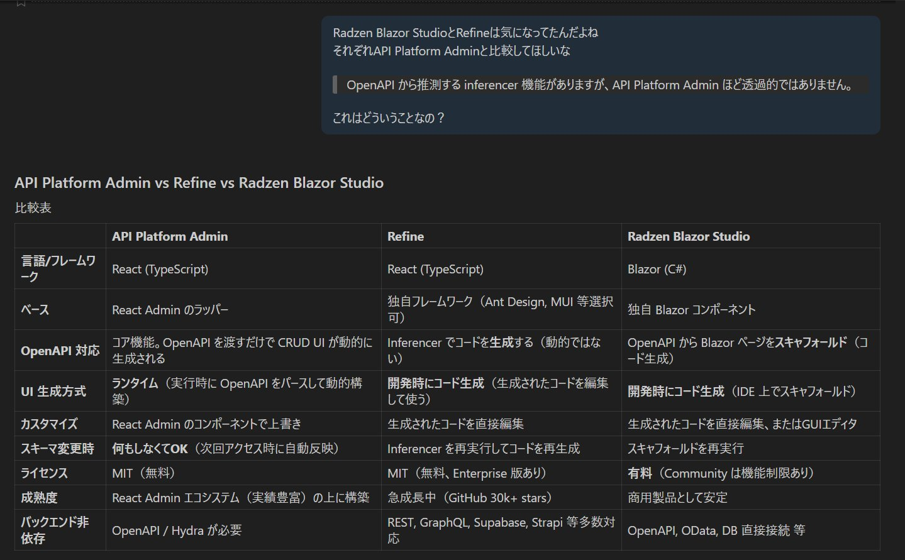
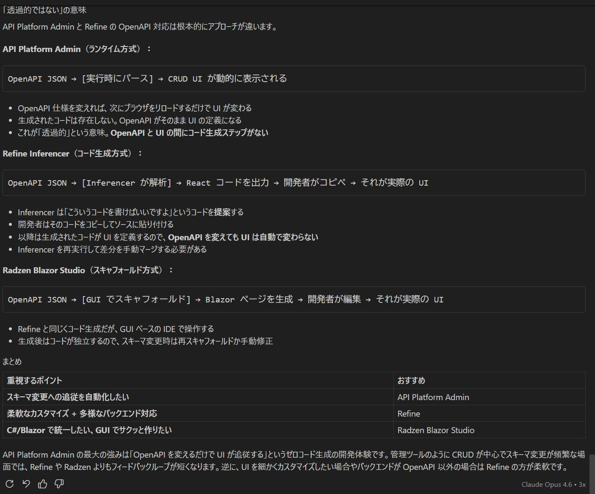

# OpenAPI から CRUD を自動構築するフレームワーク比較

> Wiki からの移行ドキュメント（2026-02-16 の調査メモ）

## 比較対象

OpenAPI 仕様を入力として CRUD UI を自動構築できるフレームワーク 3 種を比較。

| 観点 | API Platform Admin | Refine | Radzen Blazor |
|---|---|---|---|
| 言語 | TypeScript (React) | TypeScript (React) | C# (Blazor) |
| OpenAPI からの自動構築 | ✅ `OpenApiAdmin` が paths をパースして自動生成 | ⚠️ OpenAPI 対応はあるが手動設定が多い | ✅ Radzen IDE が OpenAPI からスキャフォールド |
| カスタマイズ性 | React Admin の全機能が使える | 高い（ヘッドレス UI） | IDE ベースのビジュアル編集 |
| 学習コスト | React Admin の知識が必要 | React の知識が必要 | C# エンジニアに親和性が高い |
| ライセンス | MIT | MIT | コンポーネント OSS / IDE 有料 |
| 本プロジェクトでの採用 | ✅ 採用中 | — | ToDo（検証予定） |

### 調査メモ（手書きノート）

### 補足

- **API Platform Admin** は本プロジェクトで採用中。OpenAPI 仕様の `paths` を自動パースしてリソースを検出し、`ResourceGuesser` で CRUD 画面を構築する。カスタマイズは React Admin の流儀に従う。
- **Refine** はヘッドレスアプローチで UI ライブラリを自由に選べるが、OpenAPI からの自動構築は API Platform Admin ほどシームレスではない。
- **Radzen Blazor** は C# エンジニアにとって学習コストが低く、Radzen IDE の OpenAPI 連携でスキャフォールドが可能。Blazor フレームワークの詳細比較は [技術調査: Blazor & NSwag](technical-investigation-blazor-nswag.md) を参照。
