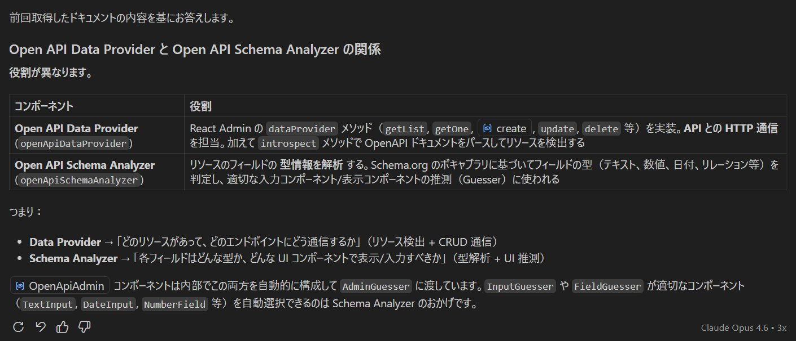

# TypeSpec + API Platform Admin における URL 設計の注意点

## OpenAPIDataProvider と OpenAPISchemaAnalyzer の関係性

API Platform Admin の内部で OpenAPI 仕様がどのように処理されるかの図解。



- **OpenAPISchemaAnalyzer**: OpenAPI 仕様 (`openapi.json`) をパースし、リソース名・フィールド定義・エンドポイントのマッピング情報を抽出する
- **OpenAPIDataProvider**: SchemaAnalyzer が解析した情報を基に、React Admin の `dataProvider` インターフェース（`getList`, `getOne`, `create`, `update`, `delete`）に変換する
- `ResourceGuesser` はこの dataProvider を通じて各リソースの CRUD 画面を自動構築する

## React Admin のルーティング規約

React Admin は `<Resource>` コンポーネントで定義されたリソースに対して、以下の固定ルートを生成します（[Routing - Route Components](https://marmelab.com/react-admin/Routing.html#route-components)）。

| ルートパターン | 画面 | マウント時に呼ばれる dataProvider メソッド |
|---|---|---|
| `/:resource` | 一覧 (list) | `getList()` |
| `/:resource/create` | 新規作成 (create) | — (`create()` は submit 時) |
| `/:resource/:id/edit` | 編集 (edit) | `getOne()` (`update()` は submit 時) |
| `/:resource/:id/show` | 詳細 (show) | `getOne()` |

`create`, `edit`, `show` は予約語として扱われ、`:id` パラメータとは区別されます。

## API Platform Admin (`OpenApiAdmin`) の役割

React Admin 自体は URL と API エンドポイントの対応を知りません（[Resource - Usage](https://marmelab.com/react-admin/Resource.html#usage)）。

> "The `<Resource>` component doesn't know this mapping - it's the dataProvider's job to define it."

本プロジェクトでは **API Platform Admin の `openApiDataProvider`** がこの役割を担っています。`OpenApiAdmin` は OpenAPI 仕様の `paths` をパースして `ResourceGuesser` の `name`（例: `"approval-requests"`）を API エンドポイント（例: `/approval-requests`, `/approval-requests/{id}`）に自動マッピングします。

## ネストした URL を設計する際の注意

**React Admin はネストされたリソースをサポートしていません**（[Resource - Nested Resources](https://marmelab.com/react-admin/Resource.html#nested-resources)）。

> "React-admin doesn't support nested resources, but you can use the children prop to render a custom component for a given sub-route."

TypeSpec でルートを定義する際、以下のようなパスの衝突に注意が必要です。

### 問題のある例

```typespec
@route("/resources")
interface Resources {
  @get list(): Resource[];
  @get read(@path id: int32): Resource;          // → /resources/{id}
}

@route("/resources/subresources")
interface SubResources {
  @get list(): SubResource[];                     // → /resources/subresources
  @get read(@path id: int32): SubResource;        // → /resources/subresources/{id}
}
```

この場合 `/resources/subresources` が `/resources/:id`（`:id = "subresources"`）と **ルートパターンが衝突** します。React Router は `subresources` という文字列をリソース `resources` の ID として解釈し、意図しない `getOne("resources", { id: "subresources" })` が発呼されることがあります。

これは React Admin の「親リソースを自動フェッチする仕様」ではなく、**ルートの衝突による副作用** です。

### 推奨する設計

- リソース名にスラッシュを含むパスを使う場合は、既存リソースのパスと衝突しないようにする
- ネストが必要な場合は `<Resource>` の `children` prop で子ルートを定義し、`useParams` で手動パラメータ取得 + `resource` prop の明示指定を行う
- React Admin の CRUD 規約に乗らないルート（例: `approve`, `reject` などのアクション）は `<CustomRoutes>` を使うか、ボタン等から直接 API を呼ぶ

```tsx
// CustomRoutes の例 (本プロジェクトの App.tsx より)
<CustomRoutes>
  <Route path="/hello-world" element={<HelloWorld />} />
</CustomRoutes>
```

## 参考: 本プロジェクトの URL マッピング

TypeSpec で定義したルートが OpenAPI → API Platform Admin を経由して最終的にどう対応するかの一覧です。

| TypeSpec ルート | OpenAPI path | React Admin URL | 画面 |
|---|---|---|---|
| `@route("/admin-tool-users")` GET | `/admin-tool-users` | `/admin-tool-users` | 一覧 |
| `@route("/admin-tool-users")` POST | `/admin-tool-users` | `/admin-tool-users/create` | 新規作成 |
| `@route("/admin-tool-users")` GET `@path id` | `/admin-tool-users/{id}` | `/admin-tool-users/{id}/edit` | 編集 |
| `@route("/admin-tool-users")` GET `@path id` | `/admin-tool-users/{id}` | `/admin-tool-users/{id}/show` | 詳細 |
| `@route("/approval-requests")` GET | `/approval-requests` | `/approval-requests` | 一覧 |
| `@route("/approval-requests")` POST | `/approval-requests` | `/approval-requests/create` | 新規作成 |
| `@route("/approval-requests/{id}/approve")` POST | `/approval-requests/{id}/approve` | — (ボタンから直接呼出) | 承認アクション |
| `@route("/approval-requests/{id}/reject")` POST | `/approval-requests/{id}/reject` | — (ボタンから直接呼出) | 却下アクション |

`approve` / `reject` のようなリソース CRUD に該当しないアクションは React Admin のルーティング規約外のため、画面上のボタンから `openapi-fetch` の型付きクライアント (`apiClient`) で直接 API を呼び出しています。パス・メソッド・パラメータは OpenAPI 型定義によりコンパイル時に検証されます。
